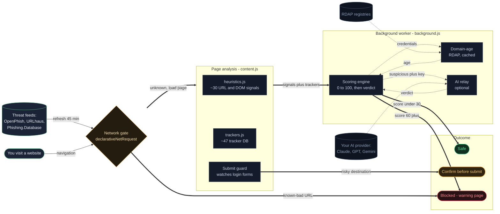

<div align="center">


# ShadowShield

**AI-assisted, real-time protection against phishing, cloned login pages, lookalike domains, and scam sites — right in your browser.**

[](https://github.com/Varshx183/ShadowShield/actions/workflows/ci.yml)
[](LICENSE)
[](manifest.json)
[](manifest.json)

*Every verdict is explainable. Every line is auditable. Nothing leaves your browser.*

</div>

---

## Why ShadowShield?

Most phishing protection is a black box: a site gets blocked, and you're told to trust the vendor. ShadowShield takes the opposite approach — **every risk score is built from named, human-readable signals** you can inspect in the popup, and the entire detection engine is open source.

It combines four independent layers of defense:

| Layer | What it does | When it acts |
|---|---|---|
| 🚫 **Live threat feeds** | Blocks confirmed scam/malware URLs from OpenPhish, URLhaus & Phishing.Database at the **network layer** — the request never leaves your machine | Before the page loads |
| 🔍 **Heuristic engine** | ~30 weighted signals: lookalike domains, homoglyphs, punycode, free-host & random-subdomain detection, credential-form abuse, urgency language | As the page loads |
| 🤖 **AI analysis** *(optional)* | Claude, GPT, or Gemini reviews suspicious pages and can escalate them to blocked — bring your own API key | Seconds after load |
| 👁 **Tracker detection** | Reveals ~45 analytics, advertising & session-recording services watching you on any page | On every page |
| ✋ **Submit guard** | Pauses password submissions to risky destinations — cross-domain, unencrypted, high-risk, or days-old sites — and asks first | The instant you press Enter |

## Install

1. **[Download the latest release](https://github.com/Varshx183/ShadowShield/releases/latest)** (grab the `.zip` under *Assets* — the first public release is `v1.0.0.zip`) — or `git clone` this repo — and extract it
2. Open `chrome://extensions` in Chrome
3. Enable **Developer mode** (top-right toggle)
4. Click **Load unpacked** and select the extracted folder
5. Pin the shield icon to your toolbar

## Releases & versioning

ShadowShield follows [Semantic Versioning](https://semver.org/) and every release from `v1.0.0` onward is generated **automatically** by [semantic-release](https://semantic-release.gitbook.io/), driven by [Conventional Commits](https://www.conventionalcommits.org/) on `main`:

- `fix: ...` commits → a patch release (`1.0.x`)
- `feat: ...` commits → a minor release (`1.x.0`)
- a commit with `BREAKING CHANGE:` in its body (or a `!` after the type, e.g. `feat!:`) → a major release (`x.0.0`)
- other commit types (`chore:`, `docs:`, `test:`, `ci:`, etc.) don't trigger a release on their own

Every release automatically: runs the full test suite first (a release is never cut on failing tests), bumps the version in `manifest.json` and `package.json`, updates the README's version badge, regenerates `CHANGELOG.md` from the commit history, creates a Git tag and a GitHub Release with generated notes, and attaches a correctly-versioned `v<version>.zip` as a downloadable asset — see [`.releaserc.json`](.releaserc.json) and [`.github/workflows/release.yml`](.github/workflows/release.yml) for the exact configuration. Nothing about versioning is manual after this point; check the [Releases page](https://github.com/Varshx183/ShadowShield/releases) for the current version and full history.

## See it working in 30 seconds

Silence on normal sites *is* the extension working — but you don't have to take that on faith:

- **Tracker panel:** open the popup on any news site — the "Trackers on this page" panel lists everything watching you, by name and category
- **Real block:** enable *Allow access to file URLs* in the extension's details, then open `demo/phishing-demo.html` from this folder. It's a harmless local page imitating phishing patterns — the real engine scores it as high-risk and blocks it
- **Feed status:** open Settings to see live counts from all four threat feeds and when they last refreshed

## Architecture

ShadowShield runs across three Chrome extension contexts — the page (content script), the background service worker, and the extension UI pages — plus external threat feeds and an optional AI provider. Detection logic lives in pure, testable modules the content script pulls in.



**Request lifecycle.** Before a page even loads, `declarativeNetRequest` rules built from the threat feeds can block a known-bad URL outright. Once a page loads, `content.js` runs the heuristic and tracker modules, sends a `PG_RESULT` to the worker, which scores it and — if dangerous — swaps the tab for the warning screen. Credential pages additionally trigger a cached RDAP domain-age lookup, and if a page is suspicious and an API key is set, an AI provider gives a second opinion that can escalate the verdict. At submit time, the guard makes the final local check. Every arrow that leaves the browser (feeds, RDAP, AI) is either public data or gated behind an explicit user choice — no page content or keystrokes ever leave except the optional, user-keyed AI sample.

## How detection works

**Domain analysis.** Lookalike detection against commonly impersonated brands with homoglyph normalization (`paypa1` → `paypal`, `rn` → `m`), brand-in-subdomain tricks (`paypal.com.evil.top`), punycode domains, raw-IP hosts, abused TLDs, credential-embedding URLs, and entropy-based random-domain detection, free-hosting-platform and dynamic-DNS detection, random/high-entropy subdomains and path segments, digits-in-name, phishing-kit filenames (raw .php/.html, WordPress internals), and credential-bait keywords in the domain or path.

**Page analysis.** Password or card fields over plain HTTP, login forms submitting credentials cross-domain, brand mentions paired with credential forms on unofficial domains, urgency language ("account suspended", "verify immediately"), and anti-inspection tricks. A mutation observer catches login forms injected late by single-page phishing kits.

**Domain age.** When a page carries a credential form (or already looks suspicious), the domain's registration date is checked via RDAP — the registries' own free lookup protocol — with 7-day local caching. Domains under 7 / 30 / 90 days old add weighted risk; "registered five days ago and asking for your password" is one of the strongest phishing tells that exists.

**Submit guard.** A capture-phase listener pauses any password-form submission when the destination is cross-domain, unencrypted, on a domain under 30 days old, or on a page scoring 30+. A confirmation overlay states the exact reasons, with an explicit "Send anyway" escape hatch. Clean logins on established sites are never interrupted, and trusted/allowlisted sites are exempt.

**Scoring.** Signals combine with diminishing returns into a 0–100 score: **0–29** safe (green badge) · **30–59** caution (amber badge + dismissible banner) · **60+** danger (full-page warning with explanation and explicit proceed option). Sensitivity is adjustable in Settings.

**Threat feeds.** Four sources merged, deduplicated, and refreshed every 45 minutes — phishing sites typically live under 48 hours, so freshness matters. Entries match as full URL prefixes, so a scam hosted on a legitimate platform (e.g. `sites.google.com/view/…`) is blocked without touching the platform itself, and a guard refuses whole-domain rules for major sites even if a feed lists one by mistake. Enforcement uses `declarativeNetRequest`, meaning Chrome's own network stack applies the rules — blocking works even while the extension's background worker is asleep.

**AI layer (optional).** Add an API key for Anthropic (Claude), OpenAI (GPT), or Google (Gemini) — the three supported providers, each a fixed hardcoded endpoint — and pages scoring ≥ 20 are automatically analyzed. The AI's risk blends with the local score, verdicts are cached per host for 6 hours, and a confident AI verdict can escalate a borderline page to fully blocked. Requests contain the page URL, title, form destinations, and a short visible-text sample — **never anything you've typed**.

## Privacy

- All scanning happens **locally in your browser** — there is no ShadowShield server, and the developer receives no data from you at all
- No telemetry, no accounts, no analytics, no remote logging
- Form values, passwords, and keystrokes are never read by any component
- Stats and settings are counters stored on your device; your API key is kept in device-local storage and never synced
- **Three things do make network requests**, all disclosed in full in [PRIVACY.md](PRIVACY.md):
  1. Downloading the public threat feeds (a download — nothing about you is sent)
  2. A domain-age check via RDAP, which sends *the domain* (not the URL, not page content) to `rdap.org` — and only when the page asks for a password or already looks suspicious, never on ordinary browsing
  3. AI analysis — **off unless you opt in with your own API key**, and then only to the one provider you chose (Claude, GPT, or Gemini — all three are fixed, hardcoded endpoints)

## Security hardening

ShadowShield is a security tool, so its own attack surface is kept minimal:

- **Strict Content Security Policy** — extension pages allow scripts only from the extension itself (`script-src 'self'`), no `eval`, no remote code, no plugins. Even a hypothetical injection can't pull in external scripts.
- **No HTML injection** — UI is built with DOM methods and `textContent`, never by parsing HTML strings, so text taken from a scanned page can never become markup.
- **Secrets stay local** — your AI API key is held in device-local storage, never Chrome's cross-device sync; a one-time migration evacuates any key from older versions.
- **Least-privilege egress** — the only outbound calls are to public threat feeds, RDAP registries, and (if you enable it) the AI provider you chose. All are explainable from the code.
- **Hostile-input validation** — data crossing a trust boundary is never trusted blindly: feed URLs are length- and hostname-validated before becoming block rules, no single feed may contribute more than 60% of the rule budget (containing a compromised feed), the optional AI response is coerced into a strict `{risk, verdict, reason}` schema with clamped ranges, and RDAP dates that are absent, unparseable, or impossible are rejected.
- **Message-sender verification** — the background worker only accepts internal messages whose `sender.id` matches the extension, so a hostile web page can't drive it.
- **Enforced by CI** — the test suite asserts the CSP is present and strict, that no `eval` exists anywhere, that the banner uses no `innerHTML`, that the API key is never written to sync storage, and that every hardening guard above holds. A regression fails the build.

The one broad permission, `<all_urls>`, is inherent to the job: a phishing scanner must be able to inspect any page you visit. It is used only to read page structure locally for scoring — never to exfiltrate page contents.

## Project structure

```
manifest.json        MV3 manifest
heuristics.js        Detection engine — pure functions, unit-testable with Node
trackers.js          Tracker database + detector
content.js           Runs the engine per page, injects the caution banner
background.js        Service worker: feeds, DNR rules, badge, auto-AI, stats
pages/warning.html   Full-page interstitial for dangerous pages
pages/popup.html     Toolbar popup: risk dial, signals, trackers, controls
pages/options.html   Settings: sensitivity, feeds, allowlist, API key
demo/                Harmless demo page to watch a block happen
tests/               Test suite (run: node tests/run-tests.js)
```

## Testing

```bash
node tests/run-tests.js
```

Covers the heuristics engine, feed parsing (all source formats), the protected-root guard, and tracker matching. CI runs the full suite plus syntax and manifest checks on every push and pull request.

## Security

Found a vulnerability? See [SECURITY.md](SECURITY.md) for how to report it privately. The project's own attack surface is analyzed in [THREAT_MODEL.md](THREAT_MODEL.md).

## Contributing

The highest-impact contributions are also the easiest — see [CONTRIBUTING.md](CONTRIBUTING.md):

- 🏷 Add impersonated brands to the database in `heuristics.js`
- 👁 Add tracker domains to `trackers.js`
- 🐛 Report false positives/negatives with the URL pattern

## Roadmap

- [ ] Real public-suffix list; brand database expansion to hundreds of entries
- [ ] Favicon similarity matching against known brands
- [ ] Chrome Web Store release
- [ ] Community "Report this site" feed

## Measured performance

The URL-heuristics layer is benchmarked against real data (500 live phishing URLs, 500 real sites from Google's CrUX ranking): **31% detection at 0.8% false positives**, reproducible via `benchmark/`. This measures *only* the URL layer in isolation — the threat feeds, page-content signals, domain-age, and AI layer are not included, so real-world protection is materially higher. Full methodology and run history in [benchmark/RESULTS.md](benchmark/RESULTS.md).

## Honest limitations

Heuristics can't catch everything — a determined attacker on a clean, well-formed domain may score low, and small legitimate sites with unusual setups may occasionally be flagged (that's what the Trust button is for). ShadowShield is a safety layer, not a guarantee: keep Chrome Safe Browsing on, and treat unexpected login prompts with suspicion regardless of what any tool tells you.

## License

[MIT](LICENSE) © ShadowShield contributors
